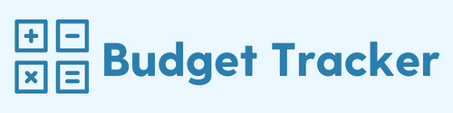

# BudgetTracker

<p align="center">
  
</p>


## Description


A budget tracker that can be used both online and offline. If entries are recorded while user is offline, they will be populated as soon as user is online.


## User Story
 
```
AS AN avid traveller
I WANT to be able to track my withdrawals and deposits with or without a data/internet connection
SO THAT my account balance is accurate when I am traveling

```

## Acceptance Criteria

```
GIVEN a user is on Budget App without an internet connection
WHEN the user inputs a withdrawal or deposit
THEN that will be shown on the page, and added to their transaction history when their connection is back online.
```


## Table of Contents
1. [Technologies](##Technologies)
2. [Usage](##Usage)
3. [License](##License)
4. [Questions](##Questions)


## Technologies

**Languages:** Node.js, HTML, CSS

**Database:** Robo 3T, MongoDB Atlas

**Dependencies:** Mongoose, Express, Morgan, lite-server

**Cloud Platform:** Heroku

## Usage

Deployed site on heroku: https://budgettracker-offline.herokuapp.com/


## License

This repository is under the MIT License.


## Questions?

Contact me at hannahcodes@protonmail.com 📫 or through my Github profile [here.](https://github.com/hannahnmcdonald) ✨


